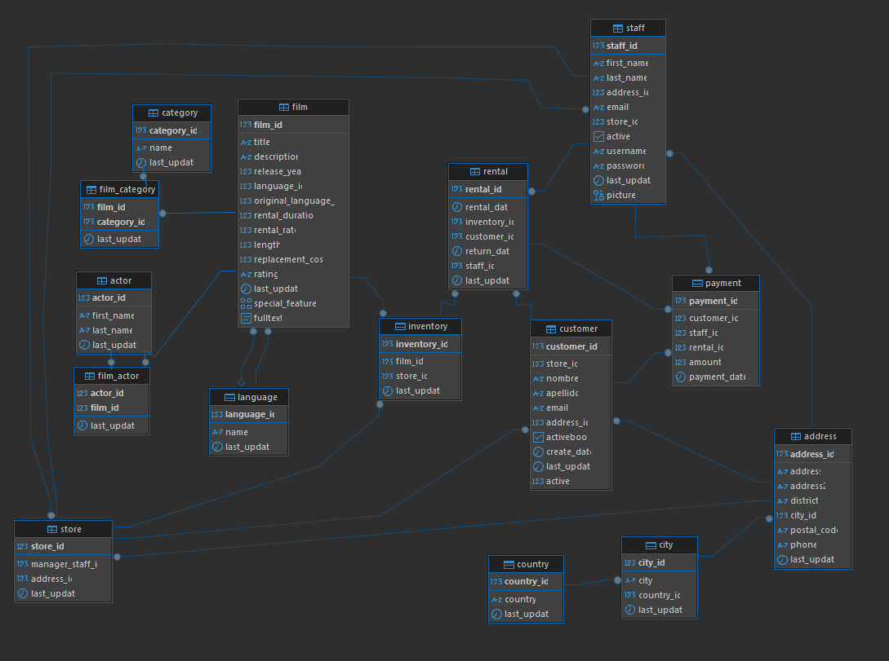

# Proyecto SQL – Lógica y Consultas

📌 Overview

Este proyecto forma parte del curso de **ThePower – Lógica. Consultas SQL**, y consiste en aplicar consultas SQL sobre una base de datos relacional proporcionada.

📁 Archivos del repositorio

📁- ProyectoConsultasSQL
    ├── 📊 BBDD_Proyecto.sql   : Script para la creación y carga de la base de datos (formato PostgreSQL).
    ├── 📊 Script.sql          : Archivo que contiene las consultas resueltas. Cada una está identificada por su   número y su enunciado como comentario.
    ├── 📄 README.md           : Este documento.
    └── Esquema_BBDD.png: Esquema visual de la base de datos 

🛠️ Pasos seguidos

1. Importación de la base de datos:  
   Se ejecutó el script `BBDD_Proyecto.sql` en el entorno DBeaver para crear todas las tablas y datos necesarios.

2. Análisis de la estructura:  
   Se revisaron las tablas, relaciones y claves primarias/foráneas, para entender la lógica interna del modelo de datos.

3. Resolución de las queries:  
   Se resolvieron todas las consultas solicitadas en el archivo `Script.sql`, asegurando:
   - Comprensión del enunciado
   - Optimización de las consultas
   - Uso de buenas prácticas (alias, comentarios, formato)

🧠 Esquema de la base de datos

El esquema extraido de la base de datos:

Algunas de las tablas principales son:

- `actor`: Contiene los nombres y apellidos de los actores; en total un conjunto de 200 actores.
- `film`: Contiene la información de las películas (título, duración, clasificación, idioma), en total 1000 películas.
- `film_Actor`: Listado de las películas que ha hecho cada actor
- `language`: Lenguajes disponibles para las películas.
- `category`: Listado de las diferentes categorías de películas, hay 16 diferentes.
- `rental`  : Registros de todos los alquileres efectuados

📌 Consideraciones

- Las consultas están orientadas a lectura y análisis de datos, sin modificaciones de datos (no hay INSERT, UPDATE o DELETE).
- Se han utilizado funciones nativas de PostgreSQL para concatenaciones, ordenamientos y filtrados.
- Algunos resultados no devuelven registros por condiciones como valores `NULL`.

▶️ Instrucciones para ejecutar el proyecto

1. Instala DBeaver, con el driver de PostgreSQL, y crea una nueva base de datos.
2. Ejecuta el script `BBDD_Proyecto.sql` para crear las tablas y poblarlas.
3. Ejecuta `Script.sql` para ver los resultados de las consultas.

✅ Estado

✔️ Proyecto finalizado con todas las consultas resueltas correctamente.

